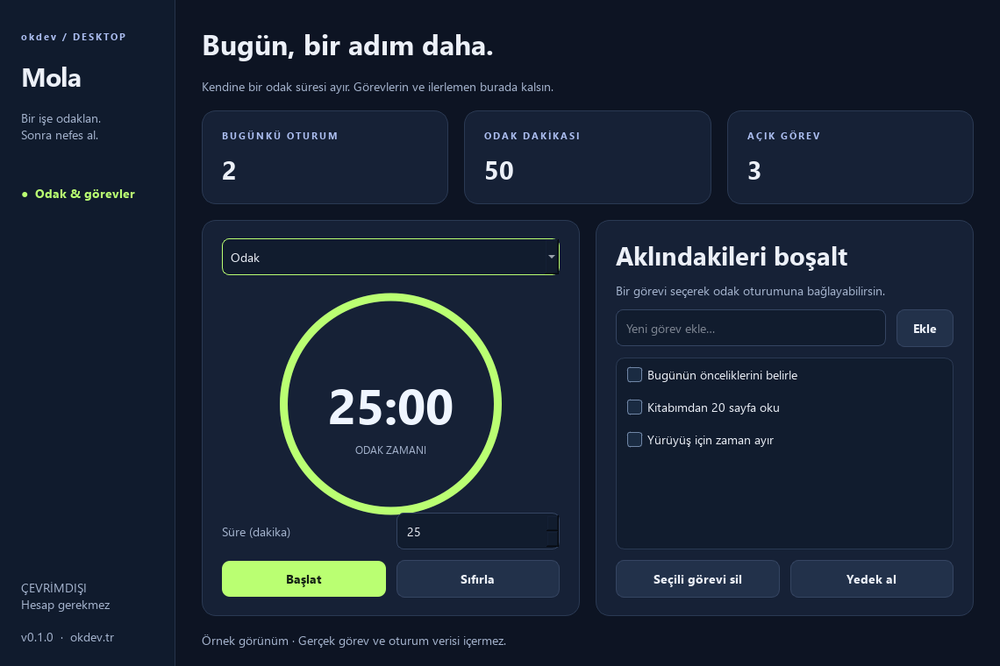

# Mola

**Bir işe odaklan. Sonra nefes al.** Türkçe odak sayacı ve görev listesi.

[Windows için indir](https://github.com/okdev01/mola/releases/download/v0.1.0/Mola-0.1.0-Windows-x64.zip) · [Tüm sürümler](https://github.com/okdev01/mola/releases) · [English summary](#english)



## Kullanım

1. ZIP dosyasını indir, tamamını çıkar ve **Mola.exe** dosyasını aç.
2. Görevlerini ekle. İstersen birini seçerek odak oturumuna bağla.
3. **Odak**, **Kısa mola** veya **Uzun mola** modunu seç; süreyi ayarla.
4. **Başlat** ile sayacı çalıştır; gerektiğinde duraklatıp devam et.
5. Bitirdiğin görevlerin kutusunu işaretle. Günlük tamamlanan odak oturumlarını üstte gör.

Python, hesap veya internet gerekmez. `_internal` klasörünü EXE'nin yanında tut.

## Özellikler

- 1–120 dakika arasında ayarlanabilen sayaç; 25/5/15 dakikalık hazır modlar.
- Duraklatma, devam etme ve sıfırlama.
- Bilgisayarda kalıcı görev listesi ve tamamlanma durumu.
- Tamamlanan odak oturumları ve günün toplam odak süresi.
- Tek dosyada SQLite yedeği alma.

Sayaç, arayüzün yenilenme hızından bağımsız bir saatle çalışır. Süre bittiğinde
uygulamanın alt durum alanında haber verir. Bu sürüm sistem bildirimi veya ses
oynatmaz; otomatik olarak sonraki oturumu başlatmaz.

## Veriler

Görev ve tamamlanan oturumlar `%LOCALAPPDATA%\OkdevDesktop\Mola\mola.db`
dosyasındadır. Ağ isteği ve telemetri yoktur. Günlük istatistikler bilgisayarın
yerel tarihine göre hesaplanır. Görev silmek tamamlanan oturum geçmişini silmez.

Tamamlanmamış bir oturum uygulama kapatıldığında veya bilgisayar yeniden
başladığında devam etmez. Çıkmadan önce onay gösterilir. Uygulama kapalıyken
sayaç çalışmaz. Uyku/askıya alma davranışı farklı sistemlerde doğrulanmadı.

Yedeği geri yüklemek için Mola'yı kapat, mevcut `mola.db` dosyasını farklı bir adla
sakla ve yedeğin bir kopyasını aynı klasöre `mola.db` adıyla yerleştir. Yedek dosyası
görev metinlerini içerir. Bu ilk sürümde uygulama içinden yedek geri yükleme yoktur.
Windows x64 için taşınabilir paket kod imzalı değildir.

## Geliştirme

```powershell
python -m venv .venv
.\.venv\Scripts\python -m pip install -r requirements-build.txt
.\.venv\Scripts\python main.py
.\.venv\Scripts\python -m unittest -v
.\.venv\Scripts\python main.py --smoke-test smoke-result.json --preview preview.png
.\.venv\Scripts\python build.py
```

Python 3.14. Altı davranış testi: kalıcılık, görev doğrulama, oturumun bir kez
sayılması, günlük sınırlar, yedekleme ve sayaç duraklatma. Arayüz ve paketli EXE
testleri geçici örnek verileri kullanır. Görsellerdeki görev ve süreler örnektir.

## English

An offline Windows focus timer and task list with a Turkish Qt interface, local
SQLite persistence, adjustable sessions and daily focus totals. No account required.

MIT · [Orçun Kara / okdev](https://okdev.tr). [Dependency notices](THIRD_PARTY_NOTICES.txt).
